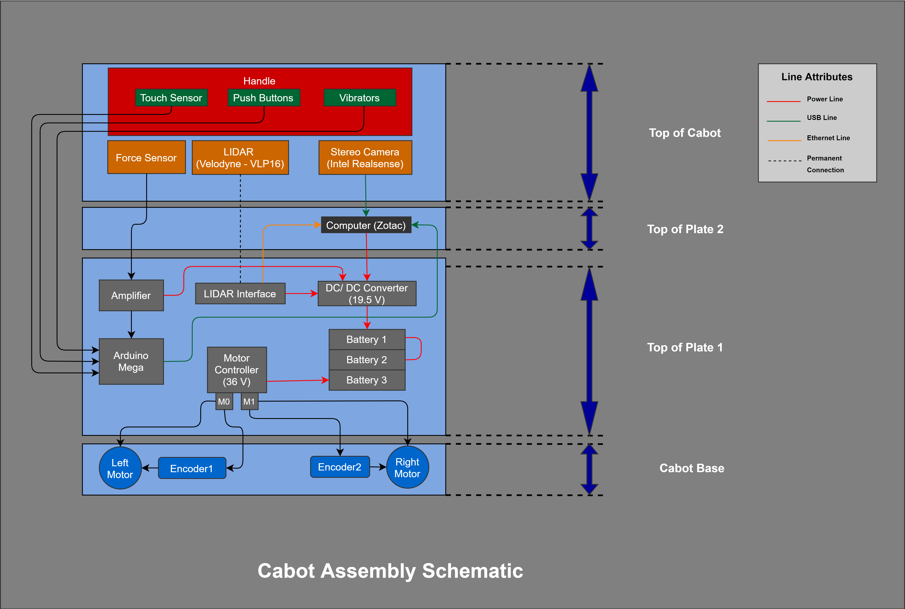
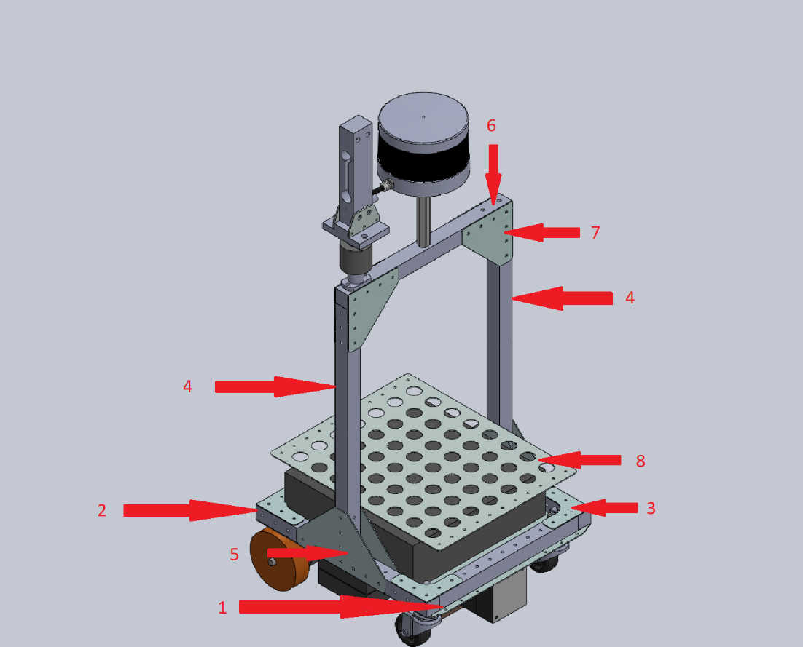

# CaBot2-e2

This repository provides three dimensional files for CaBot2-e2 parts and an instruction to build the robot from scratch.
CaBot2-e2 has an aluminum chassis mounting two direct drive brushless DC motors, two casters, and covered by a suitcase. 
The handle has tactile vibrators and input buttons for user interface. 

  

## Parts list

The list of components needed for assembling a Cabot are enlisted in [this page](./parts.md)

## Assembly Schematic

The following diagram provides an overview of the assembled view of Cabot and [cabot-e-arduino](https://github.com/CMU-cabot/cabot-e-arduino.git) repository has the wiring diagram and the code relevant to the handle (push buttons, touch sensor and vibrators) interface with Arduino Mega 2560.

  

## Assembly instructions

  

1. First procure the base plate of the robot along with all the required electronic components that need to be assembled on the robot.
2. Next, attach the drive motor clamp and the two caster wheels to the base plate (1).
3. Next, decide what components should be attached to the base plate (1) and then assemble the components on the plate. For example: If you need the Arduino Mega, Motor Controller, batteries and some other components on the top of base plate, then mount these components on the plate with the help of mounting screws that pass through several of the provided holes.
4. Next attach the four medium length tubes (2) to the four corners of the base plate (1) as shown in figure. It is preferable to clamp them to the base plate (1) with the help of several rivets using a rivet tool.
5. Then, attach the four L-shaped clamps (3) to the four corners of tubes (2) as shown in figure and clamp them with the help of rivets.
6. Later, attach the vertical chassis members (4) of the robot to the robot side body facing the wheels. The members (4) must be attached to the midpoint of tubes (2) using the triangular clamps (5) as shown in figure. It is advised to use several rivets to clamp them permanently for a sturdier fit.
7. Next, attach the top chassis member (6) using triangular clamps and suitable number of rivets. Please note that the triangular clamps should be attached on both sides of the connection.
8. Later, attach the force sensor to right corner of the chassis member (6) when the robot is front facing. You can use screws for attaching the force sensor.
9. Next the handle should be assembled separately using rivets and then connected to the top portion of the force sensor.
